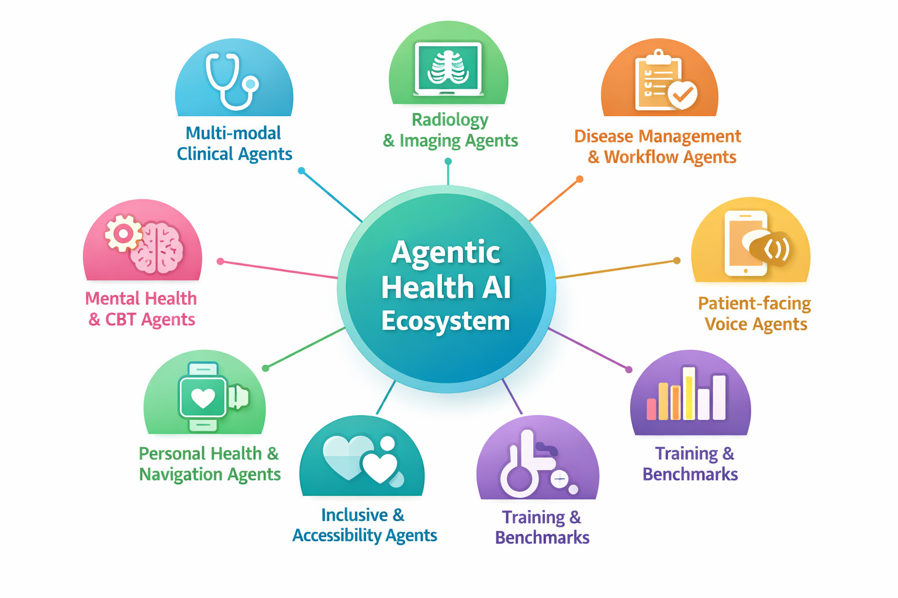

# Awesome Agentic Health AI

This repository is a curated and regularly updated collection of the **latest projects, products, papers and breakthroughs** in **agentic artificial‑intelligence (AI) for healthcare**. It draws inspiration from the original [Awesome‑AI‑Agents‑for‑Healthcare](https://github.com/AgenticHealthAI/Awesome-AI-Agents-for-Healthcare) repository, but focuses on the most recent work (through early 2026) and highlights real‑world deployments alongside academic advances. The goal is to provide an accessible starting point for clinicians, researchers and developers exploring how multi‑agent systems and agentic AI can improve patient care, medical workflow and health‑equity.

## What is agentic AI?

Traditional healthcare AI tools are largely reactive: they produce predictions or summaries when prompted but leave control of the workflow to a clinician. **Agentic AI** takes a different approach. Multiple large‑language‑model (LLM)–based agents are orchestrated to **plan tasks, retrieve relevant information, cross‑validate one another’s outputs and adapt over time**. In radiology, multi‑agent, retrieval‑augmented and uncertainty‑aware systems can reduce hallucination rates and improve diagnostic accuracy, but current implementations remain computationally demanding and require clinical validation (see [^13]). Adoption of LLMs for imaging has grown from ≈30 % of departments in 2020 to over 75 % by 2024, yet hallucination rates of 8–15 % persist (see [^13]). **Agentic AI aims to address this by distributing tasks across specialised agents and introducing checkpoints where errors are caught before they reach clinicians**.

Other commentaries highlight that agentic AI shifts radiology and other medical systems from passive, user‑triggered tools to **autonomous assistants** capable of **dynamic triaging, context‑aware reasoning and workflow management**, but they also emphasise limited clinical validation and evolving regulatory frameworks as key challenges (see [^14]).

## Ecosystem overview

The diagram below provides a high‑level view of the agentic health AI ecosystem. It captures eight major categories of agentic systems described in this repository.

### Extended ecosystem diagrams

*The “Agentic AI landscape” diagram illustrates three layers: (1) perception modalities such as conversation, clinical notes, medical imaging, electronic health records and time‑series signals; (2) agent capabilities including memory, tool use, simulation, planning & reasoning and multi‑agent collaboration; and (3) an application ecosystem spanning regulatory oversight, biomedical discovery, clinical trials, administrators, researchers, educators, public health monitoring, mental health counselling, collaborative care planning and personalised care.*

*The “Agentic AI statistics” graphic compares the number of healthcare‑specific agentic AI papers with the total number of agentic AI papers from 2023‑2025 (top line chart) and summarises research categories such as new tasks, reasoning, data loaders, instruction following, observation, retrieval‑augmented generation (RAG), tool use, graph planning, memory and model context protocol (MCP) across 2024 and 2025 (bar charts).* 

## Latest Papers

### Year 2026

1. [ICLR 2026] **MedAgentGym: Training LLM Agents for Code‑Based Medical Reasoning at Scale** [[paper]](https://openreview.net/pdf?id=oZSofhtmIc#page=0.42) [[GitHub]](https://github.com/wshi83/MedAgentGym?tab=readme-ov-file)
1. [AAAI 2026] **LungNoduleAgent: A Collaborative Multi‑Agent System for Precision Diagnosis of Lung Nodules** [[paper]](https://arxiv.org/abs/2511.21042) [[GitHub]](https://github.com/ImYangC7/LungNoduleAgent)

### Year 2025

1. [arXiv 2025.12] **Hybrid‑Code: A Privacy‑Preserving, Redundant Multi‑Agent Framework for Reliable Local Clinical Coding** [[paper]](https://arxiv.org/abs/2512.23743)
1. [arXiv 2025.12] **ClinDEF: A Dynamic Evaluation Framework for Large Language Models in Clinical Reasoning** [[paper]](https://arxiv.org/abs/2512.23440)
1. [arXiv 2025.12] **HARMON‑E: Hierarchical Agentic Reasoning for Multimodal Oncology Notes to Extract Structured Data** [[paper]](https://arxiv.org/abs/2512.19864)

## Latest projects and breakthroughs (2025–2026)

The tables below summarise notable projects and papers from 2024–2026, organised by category. Each entry lists the project or system, the year, a succinct description and the sources.

### Multi‑modal clinical agents

| Title | Venue | Date | Paper Link | Project Page |
| :---------------------------------------------------------------------------------------------------------- | :------ | :------ | :---------------------------------------------------------------------------------------------------------------------------- | :--------------------------------------------------------------------------------------------------------------------------------------------------------- |
| **MedSAM3: Delving into Segment Anything with Medical Concepts** | arXiv | 2025.11 | [Paper](https://arxiv.org/abs/2511.19046) |    [GitHub](https://github.com/Joey-S-Liu/MedSAM3) |
| **AURA: A Multi‑modal Medical Agent for Understanding, Reasoning & Annotation** | MICCAI workshop | 2025.07 | [Paper](http://arxiv.org/abs/2507.16940v1) |    [GitHub](https://github.com/nimafathi/AURA) |
| **MedAgent‑Pro: Towards Evidence‑based Multi‑modal Medical Diagnosis via Reasoning Agentic Workflow** | arXiv | 2025.03 | [Paper](https://arxiv.org/abs/2503.18968) |    [GitHub](https://github.com/jinlab-imvr/MedAgent-Pro) |
| **M^3Builder: A Multi‑Agent System for Automated Machine Learning in Medical Imaging** | arXiv | 2025.02 | [Paper](https://arxiv.org/abs/2502.20301) |    [GitHub](https://github.com/MAGIC-AI4Med/M3Builder) |

### Radiology & imaging agents

| Project/Agent | Year | Key contributions | Sources |
|---|---|---|---|
| **RadFabric** | 2025 | A multi‑agent, multimodal reasoning framework for chest‑x‑ray interpretation. Specialised agents detect pathologies, map findings to anatomical structures and synthesise visual, anatomical and clinical data. RadFabric achieves **near‑perfect detection of challenging pathologies** (accuracy 1.000) and an **overall diagnostic accuracy of 0.799** compared with 0.229–0.527 for traditional systems, demonstrating modularity and interoperability. | [^3] |
| **Diagnostic co‑pilot (AMIE)** | 2024–2025 | In a *Nature* study on differential diagnosis, the **Articulate Medical Intelligence Explorer (AMIE)** achieved a **top‑10 diagnostic accuracy of 59.1 %**, outperforming unassisted clinicians (33.6 %) and improving clinicians’ performance when used as an assistant (51.7 % vs 36.1 %). | [^4] |

### Disease‑management & workflow agents

| Project/Agent | Year | Key contributions | Sources |
|---|---|---|---|
| **AMIE for disease management** | 2025 | An extension of AMIE beyond diagnosis to **longitudinal disease management**. A two‑agent architecture pairs a **Dialogue Agent** with a **Management Reasoning Agent** that plans investigations and treatments using clinical guidelines. In randomised simulations with 100 multi‑visit scenarios, specialists rated AMIE’s management plans non‑inferior to those of primary‑care physicians and observed significant improvements in treatment precision. | [^5] |

### Patient‑facing voice agents

| Project/Agent | Year | Key contributions | Sources |
|---|---|---|---|
| **Hippocratic AI voice agents (UHS deployment)** | 2025 | Universal Health Services partnered with Hippocratic AI to deploy **generative AI voice agents** for post‑discharge phone calls. These agents follow up with patients, review medication instructions and probe for new symptoms. Thousands of patients have been contacted since launch, and the average patient satisfaction rating is **9.0 out of 10**, leading to expansion across additional hospitals. | [^6] |

### Mental‑health & CBT agents

| Project/Agent | Year | Key contributions | Sources |
|---|---|---|---|
| **AutoCBT** | 2025 | An autonomous multi‑agent framework for cognitive behavioural therapy (CBT). The system introduces **dynamic routing and supervisory mechanisms** inspired by real counselling to produce high‑quality responses. Experiments on bilingual datasets show that AutoCBT provides more helpful and contextually appropriate counselling responses than prior LLM‑based CBT systems. | [^7] |

### Personal‑health & navigation agents

| Project/Agent | Year | Key contributions | Sources |
|---|---|---|---|
| **Personal Health Agent (PHA)** | 2025 | A research prototype that analyses wearable data, questionnaires and blood biomarkers to deliver personalised health insights. The PHA decomposes tasks into a **data‑science agent**, a **domain‑expert agent** and a **health‑coach agent** that reason collaboratively. Evaluations with a real dataset (~1,200 users and >7,000 expert annotations) show improved analysis‑plan quality and more personalised responses compared with baseline models. | [^8] |
| **Wayfinding AI** | 2025 | An early‑stage agent that helps users navigate online health information. Wayfinding AI proactively asks clarifying questions to understand the user’s goals and provides deferred answers. Randomised user studies with 130 participants show that users prefer the agent over baseline models across dimensions such as helpfulness, relevance, goal understanding and engagement. | [^9] |

### Inclusive & accessibility agents

| Project/Agent | Year | Key contributions | Sources |
|---|---|---|---|
| **Agentic AI for disabilities and neurodivergence** | 2025 | A framework that assists individuals with disabilities and neurodivergence through four integrated agents: a **meal‑planner**, **reminder**, **food‑guidance** and **monitoring** agent. These agents are coordinated via a hybrid reasoning engine to provide adaptive nutrition guidance, scheduling and real‑time monitoring. Evaluations on synthetic data demonstrate improved nutritional adherence, higher reminder responsiveness, increased user satisfaction and fewer caregiver interventions. | [^10] |

### Training & benchmark environments

| Project/Agent | Year | Key contributions | Sources |
|---|---|---|---|
| **MedAgentGym** | 2025 | A **scalable interactive training environment** for code‑centric biomedical reasoning. It includes **72,413 task instances across 129 categories** derived from 12 biomedical scenarios and provides interactive feedback, verifiable ground truth and a benchmark for 29 LLMs. Training with MedAgentGym improves model performance and offers a cost‑effective alternative to proprietary models like GPT‑4o. | [^11] |

### Future & ongoing research

| Study/Initiative | Year | Description | Sources |
|---|---|---|---|
| **Nationwide randomised study of AI in virtual care** | 2026 | Google Research and Included Health announced a **nationwide randomised controlled trial** to evaluate conversational AI in real‑world virtual care. The study will assess AI‑driven clinical reasoning, personalised health insights and navigation support at scale, building on earlier work with AMIE, PHA and Wayfinding AI. | [^12] |

## Contributing

Contributions that add **new papers, products or deployments (from 2024 onward)** or improve the summaries are welcome! Please open a pull request with a clear description and provide a reliable source (peer‑reviewed paper, company announcement or reputable news article). This project follows the all‑contributors specification – contributions of any kind are welcome.

## License

This repository is distributed under the **CC‑BY‑SA 4.0** licence unless otherwise noted. Individual papers and products linked here retain their original licences; please refer to the source for details.

## Disclaimer

This list is maintained for research and educational purposes. Inclusion does not imply endorsement or clinical readiness. Many of the systems described here are research prototypes or early deployments. Always refer to regulatory guidance and consult qualified professionals before applying AI systems in clinical practice.

## References

[^1]: Jinghao Feng, Qiaoyu Zheng, Chaoyi Wu, Ziheng Zhao, Ya Zhang, Yanfeng Wang & Weidi Xie. *“M³Builder: A Multi‑Agent System for Automated Machine Learning in Medical Imaging.”* arXiv preprint (2025). The authors propose M³Builder, a multi‑agent system that automates medical‑imaging machine‑learning workflows and reports a 94.29 % task‑completion success rate across a diverse benchmark.

[^2]: Nima Fathi, Amar Kumar & Tal Arbel. *“AURA: A Multi‑Modal Medical Agent for Understanding, Reasoning & Annotation.”* arXiv preprint (2025). AURA is a multi‑modal medical agent that combines segmentation, counterfactual image generation and evaluation tools to support interactive medical‑image analysis.

[^3]: Wenting Chen, Yi Dong, Zhaojun Ding, Yucheng Shi & colleagues. *“RadFabric: Agentic AI System with Reasoning Capability for Radiology.”* Preprint (2025). RadFabric is a multi‑agent, multimodal reasoning system for chest‑X‑ray interpretation that reports near‑perfect detection of challenging pathologies and a diagnostic accuracy of 0.799, outperforming traditional baselines.

[^4]: Google Research & collaborators. *“Towards accurate differential diagnosis with large language models.”* *Nature* (2025). The Articulate Medical Intelligence Explorer (AMIE) demonstrates state‑of‑the‑art diagnostic reasoning and improves clinician performance in a large prospective study.

[^5]: Google Research. *“AMIE: Advancing large language models for disease management.”* Blog post (2025). This post describes AMIE’s Dialogue Agent and Management Reasoning Agent, which generate longitudinal management plans that match or exceed those of primary‑care physicians and improve treatment precision in randomised studies.

[^6]: Hippocratic AI & Universal Health Services. *“UHS launches Hippocratic AI’s generative AI voice agents.”* Press release (2025). The release reports that generative AI voice agents for post‑discharge phone calls achieve high patient satisfaction (average 9/10) and are being expanded across hospitals.

[^7]: Song Chen & colleagues. *“AutoCBT: An Autonomous Cognitive Behavioral Therapy Agent.”* arXiv preprint (2025). AutoCBT introduces dynamic routing and supervisory mechanisms inspired by real counselling to produce more helpful and contextually appropriate CBT responses.

[^8]: Google Research. *“Personal Health Agent: A multi‑agent system for personalised health insights.”* Blog post (2025). The PHA combines data‑science, domain‑expert and health‑coach agents; evaluations show improved analysis‑plan quality and more personalised responses compared with baseline models.

[^9]: Google Research. *“Wayfinding AI: Clarifying questions for navigating health information.”* Blog post (2025). Wayfinding AI asks clarifying questions to better understand user goals and outperforms baseline models in user studies across helpfulness, relevance and engagement.

[^10]: Salman Jan, Toqeer Ali Syed, Mohammad Riyaz Belgaum & colleagues. *“Agentic AI Framework for Individuals with Disabilities and Neurodivergence: A Multi‑Agent System for Healthy Eating, Daily Routines, and Inclusive Well‑Being.”* arXiv preprint (2025). This framework coordinates meal‑planner, reminder, food‑guidance and monitoring agents via a hybrid reasoning engine; evaluations on synthetic data show improved adherence, responsiveness and user satisfaction.

[^11]: Chen Zhu & collaborators. *“MedAgentGym: A Scalable Interactive Training Environment for Code‑Centric Biomedical Reasoning.”* arXiv preprint (2025). MedAgentGym provides 72,413 tasks across 129 categories with interactive feedback; training in this environment improves large‑language‑model performance.

[^12]: Google Research & Included Health. *“Nationwide randomised study of AI in virtual care.”* Blog post (2026). This announcement describes a large randomised controlled trial that will evaluate conversational AI for clinical reasoning, personalised insights and navigation in virtual care.

[^13]: Alon Gorenshtein, Mahmud Omar, Benjamin Glicksberg & Eyal Klang. *“AI Agents in Clinical Medicine: A Systematic Review.”* (2025). This review observes that multi‑agent, retrieval‑augmented and uncertainty‑aware systems can reduce hallucination rates and improve accuracy; adoption of large‑language models for medical imaging has increased rapidly, but hallucination rates of 8–15 % persist and computational demands remain high.

[^14]: (Authors). *“Agentic AI in Radiology: From Passive Tools to Autonomous Assistants.”* (2025). This commentary discusses the transition from passive, user‑triggered radiology tools to agentic systems capable of dynamic triaging, context‑aware reasoning and workflow management, and notes limited clinical validation and evolving regulatory frameworks.